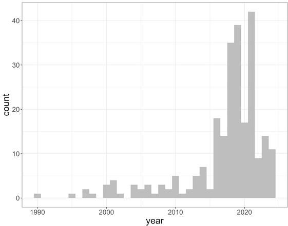

# Improved Electron Diffraction Data Model


## Sections

- [Introduction](#introduction)
- [Scope](#scope)
- [Corrections](#corrections)
- [Example Data Categories](#example-data-categories)
- [References](#references)
- [Acknowledgements](#acknowledgements)


## Introduction
Electron diffraction on two-dimensional (2D) crystals was first reported by Henderson in 1975. The first structure resolved by 2D Electron Crystallography (2DEC), bacteriorhodopsin (PDB ID: 1BRD), was deposited into the Protein Data Bank (PDB) in 1990. Between 1990 and 2012, only 36 2DEC structures were added to the PDB, with an annual deposition rate ranging from 0 to 5 entries. This landscape shifted significantly with the development of 3D Microcrystal Electron Diffraction (3D ED/MicroED), a technique that applies electron diffraction to small three-dimensional (3D) crystals. As shown in the following figure, the growth of 3D ED/MicroED has been substantial—52 3D ED/MicroED structures have been deposited in the PDB from Jan to Oct in 2025.


Figure 1: Growth of PDB structures resolved by electron diffraction.
<br>
<br>

The current PDB data model for electron diffraction structures requires updates to address the specific characteristics of 3D ED/MicroED, including its unique data acquisition and processing protocols. To support the development of an improved data model, we conducted a thorough review of the requirements for data and metadata collection by the PDB. This review covered key areas such as experimental protocols, diffraction data collection and processing, structure solution, and refinement—especially in comparison to 3DEM, X-ray crystallography, and 2DEC methods. Based on this analysis, we propose an enhanced PDB mmCIF data model tailored for electron diffraction techniques, with a focus on supporting both 3D ED/MicroED and 2DEC structures. For illustration, this document emphasizes 3D ED/MicroED-specific data features.

3D ED/MicroED is a cryo-electron microscopy (CryoEM) technique introduced in 2013 (Shi et al., 2013), designed for the structure determination of proteins from micro- or nanocrystals typically smaller than one micron. The ideal crystal thickness ranges from approximately 300 to 500 nm (Martynowycz et al., 2019), dimensions generally unsuitable for X-ray diffraction. Samples are prepared by depositing microcrystals in solution onto a carbon-coated EM grid (Shi et al., 2016). Data are collected in diffraction mode on a transmission electron microscope (TEM) using extremely low electron exposure. While early implementations involved collecting still diffraction images at discrete tilt angles (Shi et al., 2013), current protocols predominantly use continuous rotation of the crystal while recording diffraction movies on fast detectors (Shi et al., 2016). Crystal oscillation in TEM presents unique challenges, such as the difficulty in precisely controlling stage movements due to vibration constraints (Hattne et al., 2015). The resulting diffraction data can be processed with conventional X-ray crystallography software for structure solution and refinement (Hattne et al., 2015).

3D ED/MicroED offers several advantages over X-ray crystallography, including: (1) the ability to work with extremely small samples—only a few sub-micron crystals are needed, and (2) suitability for radiation-sensitive materials due to the ultra-low dose requirements (Shi et al., 2016). Compared to other microcrystal-based methods such as serial femtosecond crystallography (SFX) using X-ray free-electron lasers (XFELs), 3D ED/MicroED demands significantly less sample material. This is due to the smaller crystal size and the ability to collect multiple diffraction images from a single crystal under low-dose conditions (Wolff et al., 2020). Additionally, the longevity of crystals under 3D ED/MicroED conditions allows for collection of full reflection intensities, unlike the partials typically recorded in XFELs. As a result, fewer crystals are required, and the processes of indexing, integration, merging, and scaling are often more straightforward than in XFEL experiments (Shi et al., 2016).

Key differences between 3D ED/MicroED and 2DEC include: (1) the dimensionality of the crystals—3D ED/MicroED uses 3D nanocrystals, while 2DEC relies on 2D crystals; and (2) the data acquisition approach—3D ED/MicroED employs continuous rotation and collects full-intensity diffraction movies under ultra-low dose conditions. In contrast, 2DEC collects diffraction or image data from multiple 2D crystals over a tilt series of still images. Each 2D crystal, being a single protein layer thick, is oriented differently on the grid, and thousands of tilt-angle images are required to build a complete dataset. Structural phases in 2DEC are obtained from images or via molecular replacement. 3D ED/MicroED, by contrast, can derive a full dataset from a single 3D crystal using continuous diffraction data recorded as a movie. These methodological differences are somewhat analogous to the contrast between single-particle analysis and cryo-electron tomography (Martynowycz et al., 2018).

In summary, 3D ED/MicroED enables high-resolution structure determination from sub-micrometer 3D crystals under ultra-low dose conditions. By leveraging continuous rotation and fast movie recording, the technique yields full-intensity electron diffraction datasets that can be processed using standard X-ray crystallography tools. The growing importance of 3D ED/MicroED calls for a data model capable of capturing its unique features alongside those of traditional 2DEC approaches.


## Scope
As of Oct, 2025, there are 273 publicly released PDB structures resolved by electron diffraction method. Among them ~20% were resolved by 2DEC, and ~80% by 3D ED/MicroED. The improved electron diffraction proposed here will update all of these structures.


## Updates
Figure 2 summarizes the similarities and differences among 3D ED/MicroED, X-ray and 3DEM methods. It also lists the mmCIF data group involved for each stage of the data process and structure solution. 


Figure 2: comparison between 3D ED/MicroED, X-ray, and 3DEM data models.
<br>
<br>

All mmCIF data groups and categories have been reviewed to decide whether existing data groups/categories can be re-used for 3D ED/MicroED structures, and whether new data categories and items should be developed to record 3D ED/MicroED-specific data.

### Updates to exptl_group
Current exptl_group (https://mmcif.wwpdb.org/dictionaries/mmcif_pdbx_v50.dic/Groups/exptl_group.html) records the general crystallization process in the conventional exptl_crystal and exptl_crystal_grow categories applicable to both X-ray and Electron diffraction. With the updates, the microcrystal production is recorded in a new category of pdbx_exptl_crystal_process within the exptl_group, which can be used for both 3D ED/MicroED and BioXFEL.

#### New pdbx_exptl_subtype category to be used to differentiate between 3D ED/MicroED and 2DEC, and to record other subtypes of the primary methods.
pdbx_exptl_subtype is added to exptl_group to describe specific details about the experiments.
- _pdbx_exptl_subtype.exptl_method : This data item is a pointer to _exptl.method in the EXPTL category.
- _pdbx_exptl_subtype.method_type : The subtype of the method used in the experiment. The subtype should be a variance of the primary method recorded in the the _exptl.method item, with distinctive technical applications and significant scientific impacts, e.g.
  - Microcrystal Electron Diffraction
  - 2-Dimensional Electron Crystallography

### Updates to diffrn_group
Current diffrn_group (https://mmcif.wwpdb.org/dictionaries/mmcif_pdbx_v50.dic/Groups/diffrn_group.html) records the general diffraction data that can be re-used for 3D ED/MicroED. The updated data model enhances the diffrn_measurement category with IUCr-approved Core cif ED extension, and adds other MicroED/3DED-specific data in the new pdbx_diffrn_ed category.

### serial ED data
serial ED experiments will be recorded in the existing xfel group (https://mmcif.wwpdb.org/dictionaries/mmcif_pdbx_v50.dic/Groups/xfel_group.html) that is connected to diffrn_group by the _diffrn.pdbx_serial_crystal_experiment marker. Despite the name, the xfel group was designed to handle serial crystallography applicable to both X-ray and 3D ED/MicroED.

Details of each category can be found at [Dictionary](dict/electron_diffrn-extension.md)

## Example Data Categories

### Example of pdbx_exptl_subtype
```
#
_pdbx_exptl_subtype.exptl_method   "ELECTRON CRYSTALLOGRAPHY"
_pdbx_exptl_subtype.method_type    "Microcrystal Electron Diffraction"
#
```
### Example of pdbx_exptl_crystal_process
```
#
_pdbx_exptl_crystal_process.id				1
_pdbx_exptl_crystal_process.crystal_id			1
_pdbx_exptl_crystal_process.microcrystal_method 	"FIB milling"
_pdbx_exptl_crystal_process.microcrystal_instrument 	"Helios Hydra 5 CX dual-beam plasma FIB/SEM (Thermo Fisher Scientific)"
_pdbx_exptl_crystal_process.microcrystal_min_dim 	0.3
_pdbx_exptl_crystal_process.microcrystal_max_dim 	5
_pdbx_exptl_crystal_process.microcrystal_description 	lamella
_pdbx_exptl_crystal_process.details 			"stepwise protocol to an optimal thickness of approximately 300 nm using a 30 kV Argon plasma ion beam"
#
```
### Example of pdbx_diffrn_ed
```
#
_pdbx_diffrn_ed.id			        1
_pdbx_diffrn_ed.diffrn_id			1
_pdbx_diffrn_ed.beam_diameter_sample_plane 	3.5
_pdbx_diffrn_ed.camera_length   		1402
_pdbx_diffrn_ed.c2_aperture_diameter		50
_pdbx_diffrn_ed.details				"The microscope was aligned for low flux density using spot size 11, and gun lens setting 8 for a less bright but more coherent illumination. The energy filter was tuned to pass electrons with energy losses less than 10 eV, with the zero-loss peak centered in defocused diffraction"
_pdbx_diffrn_ed.fluence_accumulated 		0.84
_pdbx_diffrn_ed.fluence_rate 			0.002
_pdbx_diffrn_ed.electron_source 		"FIELD EMISSION GUN"
_pdbx_diffrn_ed.energyfilter_name		"TFS Selectris"
_pdbx_diffrn_ed.energyfilter_upper 		?
_pdbx_diffrn_ed.energyfilter_lower 		?
_pdbx_diffrn_ed.recording_mode			"Electron Counting"
_pdbx_diffrn_ed.sa_aperture_diameter 		150
#

```
### Example of diffrn_measurement
```
#
_diffrn_measurement.diffrn_id				1
_diffrn_measurement.details				1
_diffrn_measurement.method				?
_diffrn_measurement.method_precession 			N
_diffrn_measurement.pdbx_angle_start			0
_diffrn_measurement.pdbx_angle_end 			20
_diffrn_measurement.pdbx_exposure_time_per_image 	1
_diffrn_measurement.pdbx_rotation_rate			0.0476
_diffrn_measurement.rotation_mode 			rotation
_diffrn_measurement.sample_tracking 			?
_diffrn_measurement.sample_tracking_method 		?		
#
```
## References
From electron crystallography of 2D crystals to MicroED of 3D crystals.
Martynowycz MW, Gonen T.
Curr Opin Colloid Interface Sci. 2018 Mar;34:9-16. doi: 10.1016/j.cocis.2018.01.010.

Three-dimensional electron crystallography of protein microcrystals.
Shi D, Nannenga BL, Iadanza MG, Gonen T.
Elife. 2013 Nov 19;2:e01345. doi: 10.7554/eLife.01345.

Qualitative Analyses of Polishing and Precoating FIB Milled Crystals for MicroED.
Martynowycz MW, Zhao W, Hattne J, Jensen GJ, Gonen T.
Structure. 2019 Oct 1;27(10):1594-1600.e2. doi: 10.1016/j.str.2019.07.004.

The collection of MicroED data for macromolecular crystallography.
Shi D, Nannenga BL, de la Cruz MJ, Liu J, Sawtelle S, Calero G, Reyes FE, Hattne J, Gonen T.
Nat Protoc. 2016 May;11(5):895-904. doi: 10.1038/nprot.2016.046.

MicroED data collection and processing.
Hattne J, Reyes FE, Nannenga BL, Shi D, de la Cruz MJ, Leslie AG, Gonen T.
Acta Crystallogr A Found Adv. 2015 Jul;71(Pt 4):353-60. doi: 10.1107/S2053273315010669.
 
Comparing serial X-ray crystallography and microcrystal electron diffraction (MicroED) as methods for routine structure determination from small macromolecular crystals.
Wolff AM, Young ID, Sierra RG, Brewster AS, Martynowycz MW, Nango E, Sugahara M, Nakane T, Ito K, Aquila A, Bhowmick A, Biel JT, Carbajo S, Cohen AE, Cortez S, Gonzalez A, Hino T, Im D, Koralek JD, Kubo M, Lazarou TS, Nomura T, Owada S, Samelson AJ, Tanaka T, Tanaka R, Thompson EM, van den Bedem H, Woldeyes RA, Yumoto F, Zhao W, Tono K, Boutet S, Iwata S, Gonen T, Sauter NK, Fraser JS, Thompson MC.
IUCrJ. 2020 Feb 26;7(Pt 2):306-323. doi: 10.1107/S205225252000072X.


## Acknowledgements
The electron diffraction data model improvement project is a wwPDB collaborative project that is carried out principally by [RCSB PDB](https://rcsb.org/) at Rutgers, The State University of New Jersey and is funded by the U.S. National Science Foundation (DBI-2321666), the US Department of Energy (DE-SC0019749), and the National Cancer Institute, National Institute of Allergy and Infectious Diseases, and National Institute of General Medical Sciences of the National Institutes of Health under grant R01GM157729.
