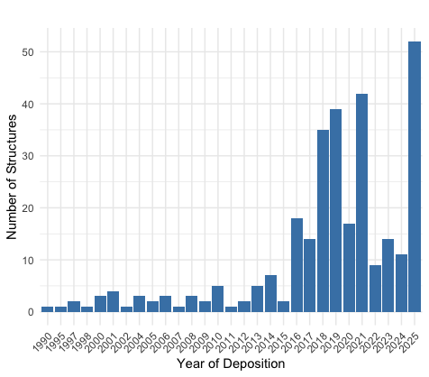

# Improved Electron Diffraction Data Model


## Sections

- [Introduction](#introduction)
- [Scope](#scope)
- [Corrections](#corrections)
- [Example Data Categories](#example-data-categories)
- [References](#references)
- [Acknowledgements](#acknowledgements)


## Introduction
Electron diffraction on two-dimensional (2D) crystals was first reported by Henderson in 1975. The first structure resolved by 2D Electron Crystallography (2DEC), bacteriorhodopsin (PDB ID: 1BRD), was deposited into the Protein Data Bank (PDB) in 1990. Between 1990 and 2012, only 36 2DEC structures were added to the PDB, with an annual deposition rate ranging from 0 to 5 entries. This landscape shifted significantly with the development of Microcrystal Electron Diffraction (MicroED), a technique that applies electron diffraction to small three-dimensional (3D) crystals. As shown in the following figure, the growth of MicroED has been substantial—over 40 MicroED structures were deposited in the PDB in 2021 alone.


Figure 1: Growth of PDB structures resolved by electron diffraction.
<br>
<br>

The current PDB data model for electron diffraction structures requires updates to address the specific characteristics of MicroED, including its unique data acquisition and processing protocols. To support the development of an improved data model, we conducted a thorough review of the requirements for data and metadata collection by the PDB. This review covered key areas such as experimental protocols, diffraction data collection and processing, structure solution, and refinement—especially in comparison to 3DEM, X-ray crystallography, and 2DEC methods. Based on this analysis, we propose an enhanced PDB mmCIF data model tailored for electron diffraction techniques, with a focus on supporting both MicroED and 2DEC structures. For illustration, this paper emphasizes MicroED-specific data features.

MicroED is a cryo-electron microscopy (CryoEM) technique introduced in 2013 (Shi et al., 2013), designed for the structure determination of proteins from micro- or nanocrystals typically smaller than one micron. The ideal crystal thickness ranges from approximately 300 to 500 nm (Martynowycz et al., 2019), dimensions generally unsuitable for X-ray diffraction. Samples are prepared by depositing microcrystals in solution onto a carbon-coated EM grid (Shi et al., 2016). Data are collected in diffraction mode on a transmission electron microscope (TEM) using extremely low electron exposure. While early implementations involved collecting still diffraction images at discrete tilt angles (Shi et al., 2013), current protocols predominantly use continuous rotation of the crystal while recording diffraction movies on fast detectors (Shi et al., 2016). Crystal oscillation in TEM presents unique challenges, such as the difficulty in precisely controlling stage movements due to vibration constraints (Hattne et al., 2015). The resulting diffraction data can be processed with conventional X-ray crystallography software for structure solution and refinement (Hattne et al., 2015).

MicroED offers several advantages over X-ray crystallography, including: (1) the ability to work with extremely small samples—only a few sub-micron crystals are needed, and (2) suitability for radiation-sensitive materials due to the ultra-low dose requirements (Shi et al., 2016). Compared to other microcrystal-based methods such as serial femtosecond crystallography (SFX) using X-ray free-electron lasers (XFELs), MicroED demands significantly less sample material. This is due to the smaller crystal size and the ability to collect multiple diffraction images from a single crystal under low-dose conditions (Wolff et al., 2020). Additionally, the longevity of crystals under MicroED conditions allows for collection of full reflection intensities, unlike the partials typically recorded in XFELs. As a result, fewer crystals are required, and the processes of indexing, integration, merging, and scaling are often more straightforward than in XFEL experiments (Shi et al., 2016).

Key differences between MicroED and 2DEC include: (1) the dimensionality of the crystals—MicroED uses 3D nanocrystals, while 2DEC relies on 2D crystals; and (2) the data acquisition approach—MicroED employs continuous rotation and collects full-intensity diffraction movies under ultra-low dose conditions. In contrast, 2DEC collects diffraction or image data from multiple 2D crystals over a tilt series of still images. Each 2D crystal, being a single protein layer thick, is oriented differently on the grid, and thousands of tilt-angle images are required to build a complete dataset. Structural phases in 2DEC are obtained from images or via molecular replacement. MicroED, by contrast, can derive a full dataset from a single 3D crystal using continuous diffraction data recorded as a movie. These methodological differences are somewhat analogous to the contrast between single-particle analysis and cryo-electron tomography (Martynowycz et al., 2018).

In summary, MicroED enables high-resolution structure determination from sub-micrometer 3D crystals under ultra-low dose conditions. By leveraging continuous rotation and fast movie recording, the technique yields full-intensity electron diffraction datasets that can be processed using standard X-ray crystallography tools. The growing importance of MicroED calls for a data model capable of capturing its unique features alongside those of traditional 2DEC approaches.


## Scope
As of June 18, 2025, there are 267 publicly released PDB structures resolved by electron diffraction method. Among them ~20% were resolved by 2DEC, and ~80% by MicroED. There are also 30+ structures that have been deposited but not released yet, raising the total to ~300. The improved electron diffraction proposed here will update all of these strutures.


## Corrections
Figure 2 summarize the similarities and differences among MicroED, X-ray and 3DEM methods. It also lists the mmCIF data group involved for each stage of the data process and structure solution. 


Figure 2: comparison between MicroED, X-ray, and 3DEM data models.
<br>
<br>

Each of the mmCIF data groups and categories have been reviewed to decide whether an existing data group/category can be re-used for MicroED structures, or a new group/category should be developed because of the uniqueness of the MicroED structures.

### Existing mmCIF data groups to be reused for MicroED
The following data categories have been used for MicroED structures and will be used continuously. 
- exptl_group 
- refln_group 
- refine_group 
- computing_group (software category only)

### Existing mmCIF data groups NOT to be used for MicroED
- diffrn_group: This X-ray specific diffraction data collection group do not have significant  insufficient data items to cover MicroED data collection process 
- em_group: Attempt was made to establish an alternate MicroED data model re-using the em_group. The alternate data model has been shared, reviewed, and discussed among wwPDB partners and deemed inappropriate because it requires significant changes to the current em_group in order to adapt to the MicroED method.

### New electron_diffn_group to be used for MicroED
This new group is used to capture the metadata for the unique features of the MicroED method, i.e. the crytal sample preparation and electron diffraction data collection process highlighted in Figure 2, with 6 new catetories introduced.
- pdbx_electron_diffrn: Describes individual diffraction processes
- pdbx_electron_diffrn_crystal_prep: Describes microcrystal preparation
- pdbx_electron_diffrn_source: Describe the electron source
- pdbx_electron_diffrn_detector: Describes the detector/camera
- pdbx_electron_diffrn_continuous_rotation: Describes continuous rotation data collection
- pdbx_electron_diffrn_discrete_angle: Describes data collection at still discrete angles
<br>

Details of each category can be found at [Dictionary](dict/electron_diffrn-extension.md)

### New pdbx_exptl_subtype to be used to diffrentiate between MicroED and 2DEC, and to record other subtypes of the primary methods.
pdbx_exptl_subtype describes specific details about the experiments in the EXPTL category.
- _pdbx_exptl_subtype.exptl_method : This data item is a pointer to _exptl.method in the EXPTL category.
- _pdbx_exptl_subtype.method_type : The subtype of the method used in the experiment. The subtype should be a variance of the primary method recorded in the the _exptl.method item, with distinctive technical applications and significant scientific impacts, e.g.
  - Microcrystal Electron Diffraction
  - 2-Dimensional Electron Crystallography


## Example Data Categories

### Example of pdbx_exptl_subtype
```
#
_pdbx_exptl_subtype.exptl_method   "ELECTRON CRYSTALLOGRAPHY"
_pdbx_exptl_subtype.method_type    "Microcrystal Electron Eiffraction"
#
```
### Example of pdbx_electron_diffrn_crystal_prep
```
#
_pdbx_electron_diffrn_crystal_prep.id					1
_pdbx_electron_diffrn_crystal_prep.electron_diffrn_id			1  
_pdbx_electron_diffrn_crystal_prep.crystal_id				1  
_pdbx_electron_diffrn_crystal_prep.grid					"gold glider grid"   
_pdbx_electron_diffrn_crystal_prep.grid_film				?
_pdbx_electron_diffrn_crystal_prep.vitrification_method			"plunged into liquid ethane without blotting"
_pdbx_electron_diffrn_crystal_prep.vitrification_cryogen		ETHANE
_pdbx_electron_diffrn_crystal_prep.microcrystal_method			"FIB milling"
_pdbx_electron_diffrn_crystal_prep.microcrystal_instrument    		"Thermo Fisher Helios Hydra dual-beam plasma beam FIB/SEM"
_pdbx_electron_diffrn_crystal_prep.microcrystal_min_dim			0.3
_pdbx_electron_diffrn_crystal_prep.microcrystal_max_dim			20
_pdbx_electron_diffrn_crystal_prep.microcrystal_description		lamella
_pdbx_electron_diffrn_crystal_prep.details				"crystal grew on the grid"
#
```
### Example of pdbx_electron_diffrn
```
#
_pdbx_electron_diffrn.entry_id				8SDK	
_pdbx_electron_diffrn.id				1  
_pdbx_electron_diffrn.crystal_id			1  
_pdbx_electron_diffrn.detector_distance			1550 
_pdbx_electron_diffrn.temperature			100
_pdbx_electron_diffrn.tilt_method			"continuous rotation"
_pdbx_electron_diffrn.collection_date			2023-01-01
_pdbx_electron_diffrn.total_images			700
_pdbx_electron_diffrn.details				?
#

```
### Example of pdbx_electron_diffrn_source
```
#
_pdbx_electron_diffrn_source.id				1
_pdbx_electron_diffrn_source.electron_diffrn_id		1  
_pdbx_electron_diffrn_source.instrument_model		"FEI TITAN KRIOS"
_pdbx_electron_diffrn_source.dose_rate			?
_pdbx_electron_diffrn_source.dose_accumulated		0.64
_pdbx_electron_diffrn_source.accelerating_voltage 	300
_pdbx_electron_diffrn_source.electron_source	 	"FIELD EMISSION GUN"
_pdbx_electron_diffrn_source.details			?
#
```
### Example of pdbx_electron_diffrn_detector
```
#
_pdbx_electron_diffrn_detector.id			1
_pdbx_electron_diffrn_detector.electron_diffrn_id	1  
_pdbx_electron_diffrn_detector.detector_camera		"FEI FALCON IV (4k x 4k)"
_pdbx_electron_diffrn_detector.detector_sensor		CMOS	
_pdbx_electron_diffrn_detector.mode			Counting
_pdbx_electron_diffrn_detector.details			?
#
```
### Example of pdbx_electron_diffrn_continuous_rotation
```
#
_pdbx_electron_diffrn_continuous_rotation.id				1
_pdbx_electron_diffrn_continuous_rotation.electron_diffrn_id		1  
_pdbx_electron_diffrn_continuous_rotation.angle_start			-30
_pdbx_electron_diffrn_continuous_rotation.angle_end			30
_pdbx_electron_diffrn_continuous_rotation.rotation_rate			0.2
_pdbx_electron_diffrn_continuous_rotation.exposure_time_per_image 	?
_pdbx_electron_diffrn_continuous_rotation.angle_per_image               ?
_pdbx_electron_diffrn_continuous_rotation.details			?
#
```
### Example of pdbx_electron_diffrn_discrete_angle
```

```
## References
From electron crystallography of 2D crystals to MicroED of 3D crystals.
Martynowycz MW, Gonen T.
Curr Opin Colloid Interface Sci. 2018 Mar;34:9-16. doi: 10.1016/j.cocis.2018.01.010.

Three-dimensional electron crystallography of protein microcrystals.
Shi D, Nannenga BL, Iadanza MG, Gonen T.
Elife. 2013 Nov 19;2:e01345. doi: 10.7554/eLife.01345.

Qualitative Analyses of Polishing and Precoating FIB Milled Crystals for MicroED.
Martynowycz MW, Zhao W, Hattne J, Jensen GJ, Gonen T.
Structure. 2019 Oct 1;27(10):1594-1600.e2. doi: 10.1016/j.str.2019.07.004.

The collection of MicroED data for macromolecular crystallography.
Shi D, Nannenga BL, de la Cruz MJ, Liu J, Sawtelle S, Calero G, Reyes FE, Hattne J, Gonen T.
Nat Protoc. 2016 May;11(5):895-904. doi: 10.1038/nprot.2016.046.

MicroED data collection and processing.
Hattne J, Reyes FE, Nannenga BL, Shi D, de la Cruz MJ, Leslie AG, Gonen T.
Acta Crystallogr A Found Adv. 2015 Jul;71(Pt 4):353-60. doi: 10.1107/S2053273315010669.
 
Comparing serial X-ray crystallography and microcrystal electron diffraction (MicroED) as methods for routine structure determination from small macromolecular crystals.
Wolff AM, Young ID, Sierra RG, Brewster AS, Martynowycz MW, Nango E, Sugahara M, Nakane T, Ito K, Aquila A, Bhowmick A, Biel JT, Carbajo S, Cohen AE, Cortez S, Gonzalez A, Hino T, Im D, Koralek JD, Kubo M, Lazarou TS, Nomura T, Owada S, Samelson AJ, Tanaka T, Tanaka R, Thompson EM, van den Bedem H, Woldeyes RA, Yumoto F, Zhao W, Tono K, Boutet S, Iwata S, Gonen T, Sauter NK, Fraser JS, Thompson MC.
IUCrJ. 2020 Feb 26;7(Pt 2):306-323. doi: 10.1107/S205225252000072X.


## Acknowledgements
The electron diffraction data model improvement project is a wwPDB collaborative project that is carried out principally by [RCSB PDB](https://rcsb.org/) at Rutgers, The State University of New Jersey and is funded by the U.S. National Science Foundation (DBI-2321666), the US Department of Energy (DE-SC0019749), and the National Cancer Institute, National Institute of Allergy and Infectious Diseases, and National Institute of General Medical Sciences of the National Institutes of Health under grant R01GM157729.
