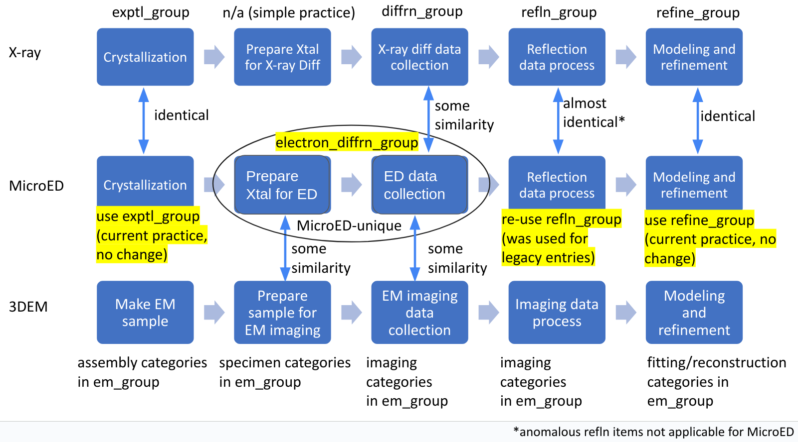

# Improved Electron Diffraction Data Model


## Sections

- [Introduction](#introduction)
- [Scope](#scope)
- [Corrections](#corrections)
- [Example Data Categories](#example-data-categories)
- [References](#references)
- [Acknowledgements](#acknowledgements)


## Introduction

Electron Diffraction on 2D crystals was first reported by Henderson in 1975. The first PDB structure (PDB ID 1BRD) of bacteriorhodopsin resolved by 2D Electron Crystallography (2DEC) was deposited in 1990. In the 22 years from 1990 to 2012, there were only 36 2DEC structures deposited into PDB, with 0-5 for each year. However, the situation changed when Microcrystal Electron Diffraction (MicroED) method was developed to apply electron diffraction on small 3D crystals, with the growth demonstrated in the following figure. 40+ MicroED structures were deposited into the PDB in 2021 alone.


Figure 1: Growth of PDB structures resolved by electron diffraction.

The current PDB data model to process electron diffraction structures needs to be updated to addess the uniqueness of MicroED structures and data process. In order to develop the proper model, we started to review the requirements for PDB to collect data and metadata on experimental process, diffraction data collection, diffraction data process, structural solution, and refinement of MicroED method, especially in comparison to 3DEM, X-ray, and 2DEC. Here, an improved PDB mmCIF data model for the electron diffraction method method is then proposed to fulfill the requirements, and aim to handle both MicroED and 2DEC structures, although in the following text MicroED data features are focused on for demonstration. 

MicroED is a CryoEM method that was developed in 2013 using electron diffraction data on 3D microcrystals (Shi et al., 2013). The method was developed for structure determination of proteins from microcrystals (or nanocrystals)  that are usually in the size of sub-micron, with an ideal thickness of approximately 300-500 nm (Martynowycz et al., 2019) that are usually too thin for X-ray diffraction. Samples are usually prepared by depositing microcrystals in solution on a carbon-coated EM grid (Shi et al., 2016). Transmission electron microscope (TEM) is used in diffraction mode with an extremely low electron exposure (Shi et al., 2016). Although still diffraction images were collected at the discrete tilt angles during the early stage of the method development (Shi et al., 2013), for most of the current research the microcrystal is continuously rotated while diffraction is collected on a fast camera as a movie (Shi et al., 2016). “On an electron microscope crystal oscillation is complicated by difficulties in accurately positioning the stage, which is typically optimized to reduce vibrations during long exposures” (Hattne et al., 2015). MicroED diffraction data is then processed using traditional software for X-ray crystallography for structure analysis and refinement (Hattne et al., 2015). 

The advantages of MicroED against X-ray Crystallography include: (1) very small sample size with only a few sub-micro sized crystals needed; (2) radiation-sensitive biological materials can be studied with the extremely low dose (Shi et al., 2016). The sample amount needed for MicroED is significantly smaller than that for XFEL/X-ray serial crystallography, another method of using microcrystals, because of the smaller crystal size and the collection of multiple diffraction images on the same crystal with extremely low dose (Wolff et al., 2020). The long lasting crystal also allows recording of full reflection intensities rather than the partials recorded in XFELs. As such, fewer crystals are needed, and the indexing, merging, integration and scaling are more straightforward than in XFEL experiments (Shi et al., 2016).

The major differences between MicroED and 2DEC include: (1) the dimension of the crystal; (2) the data collection protocol featuring extremely low dose and full intensity diffraction data. "Electron crystallography collects diffraction data or images from two-dimensional crystals using still images over a range of tilt angles to solve structures. A two-dimensional protein crystal is an array of regularly arranged protein in X and Y (two dimensions) but is only a single protein layer thick. Each 2D crystal is oriented differently on the grid and images of a thousand 2D crystals collected at different tilt angles. The data is then combined to a single dataset that is then used for structure determination. Phases come from images or by molecular replacement. In sharp contrast, MicroED is electron diffraction from three-dimensional crystals up to a micrometer thick, not 2D crystals, and a single 3D nanocrystal is sometimes sufficient for the collection of an entire dataset. The crystal is continuously diffracted and under continuous rotation. The data is collected on a fast camera as a movie and processed using standard X-ray diffraction software. In this way, electron crystallography of 2D crystals is a more stochastic methodology, whereas MicroED is prescribed to a single 3D crystal sample. These differences are reminiscent of the differences between single particle analysis and cryotomography, respectively." ( Martynowycz et al., 2018). In summary, the MicroED technique is used to collect high-resolution electron diffraction data sets from sub-micrometer sized 3D protein crystals at extremely low-dose, with electron diffraction movies of full intensity collected using the continuous rotation method can then be processed by standard X-ray crystallographic programs.


## Scope
As of June 18, 2025, there are 267 publicly released PDB structures resolved by electron diffraction method. Among them ~20% were resolved by 2DEC, and ~80% by MicroED. There are also 30+ structures that have been deposited but not released yet, raising the total to ~300. The improved electron diffraction proposed here will update all of these strutures.


## Corrections
Figure 2 summarize the similarities and differences among MicroED, X-ray and 3DEM methods. It also lists the mmCIF data group involved for each stage of the data process and structure solution. 


Figure 2: comparison between MicroED, X-ray, and 3DEM data models.

Each of the mmCIF data groups and categories have been reviewed to decide whether an existing data group/category can be re-used for MicroED structures, or a new group/category should be developed because of the uniqueness of the MicroED structures.

### Existing mmCIF data groups to be reused for MicroED
The following data categories have been used for MicroED structures and will be used continuously. 
- exptl_group 
- refln_group 
- refine_group 
- computing_group (software category only)

### Existing mmCIF data groups NOT to be used for MicroED
- diffrn_group: This X-ray specific diffraction data collection group do not have significant  insufficient data items to cover MicroED data collection process 
- em_group: Attempt was made to establish an alternate MicroED data model re-using the em_group. The alternate data model has been shared, reviewed, and discussed among wwPDB partners and deemed inappropriate because it requires significant changes to the current em_group in order to adapt to the MicroED method.

### New electron_diffn_group to be used for MicroED
This new group is used to capture the metadata for the unique features of the MicroED method, i.e. the crytal sample preparation and electron diffraction data collection process highlighted in Figure 2, with 6 new catetories introduced.
- pdbx_electron_diffrn: Describes individual diffraction processes
- pdbx_electron_diffrn_crystal_prep: Describes microcrystal preparation
- pdbx_electron_diffrn_source: Describe the electron source
- pdbx_electron_diffrn_detector: Describes the detector/camera
- pdbx_electron_diffrn_continuous_rotation: Describes continuous rotation data collection
- pdbx_electron_diffrn_discrete_angle: Describes data collection at still discrete angles
Details of each category can be found at [Dictionary](dict/electron_diffrn-extension.md)

### New pdbx_exptl_subtype to be used to diffrentiate between MicroED and 2DEC, and to record other subtypes of the primary methods.
pdbx_exptl_subtype describes specific details about the experiments in the EXPTL category.
- _pdbx_exptl_subtype.exptl_method : This data item is a pointer to _exptl.method in the EXPTL category.
- _pdbx_exptl_subtype.method_type : The subtype of the method used in the experiment. The subtype should be a variance of the primary method recorded in the the _exptl.method item, with distinctive technical applications and significant scientific impacts, e.g.
* Microcrystal Electron Diffraction
* 2-Dimensional Electron Crystallography


## Example Data Categories

### Example of method subtype
```
#
_pdbx_exptl_subtype.exptl_method   "ELECTRON CRYSTALLOGRAPHY"
_pdbx_exptl_subtype.method_type    "Microcrystal Electron Eiffraction"
#
```


## References
From electron crystallography of 2D crystals to MicroED of 3D crystals.
Martynowycz MW, Gonen T.
Curr Opin Colloid Interface Sci. 2018 Mar;34:9-16. doi: 10.1016/j.cocis.2018.01.010.

Three-dimensional electron crystallography of protein microcrystals.
Shi D, Nannenga BL, Iadanza MG, Gonen T.
Elife. 2013 Nov 19;2:e01345. doi: 10.7554/eLife.01345.

Qualitative Analyses of Polishing and Precoating FIB Milled Crystals for MicroED.
Martynowycz MW, Zhao W, Hattne J, Jensen GJ, Gonen T.
Structure. 2019 Oct 1;27(10):1594-1600.e2. doi: 10.1016/j.str.2019.07.004.

The collection of MicroED data for macromolecular crystallography.
Shi D, Nannenga BL, de la Cruz MJ, Liu J, Sawtelle S, Calero G, Reyes FE, Hattne J, Gonen T.
Nat Protoc. 2016 May;11(5):895-904. doi: 10.1038/nprot.2016.046.

MicroED data collection and processing.
Hattne J, Reyes FE, Nannenga BL, Shi D, de la Cruz MJ, Leslie AG, Gonen T.
Acta Crystallogr A Found Adv. 2015 Jul;71(Pt 4):353-60. doi: 10.1107/S2053273315010669.
 
Comparing serial X-ray crystallography and microcrystal electron diffraction (MicroED) as methods for routine structure determination from small macromolecular crystals.
Wolff AM, Young ID, Sierra RG, Brewster AS, Martynowycz MW, Nango E, Sugahara M, Nakane T, Ito K, Aquila A, Bhowmick A, Biel JT, Carbajo S, Cohen AE, Cortez S, Gonzalez A, Hino T, Im D, Koralek JD, Kubo M, Lazarou TS, Nomura T, Owada S, Samelson AJ, Tanaka T, Tanaka R, Thompson EM, van den Bedem H, Woldeyes RA, Yumoto F, Zhao W, Tono K, Boutet S, Iwata S, Gonen T, Sauter NK, Fraser JS, Thompson MC.
IUCrJ. 2020 Feb 26;7(Pt 2):306-323. doi: 10.1107/S205225252000072X.


## Acknowledgements
The electron diffraction data model improvement project is a wwPDB collaborative project that is carried out principally by [RCSB PDB](https://rcsb.org/) at Rutgers, The State University of New Jersey and is funded by the U.S. National Science Foundation (DBI-2321666), the US Department of Energy (DE-SC0019749), and the National Cancer Institute, National Institute of Allergy and Infectious Diseases, and National Institute of General Medical Sciences of the National Institutes of Health under grant R01GM157729.
